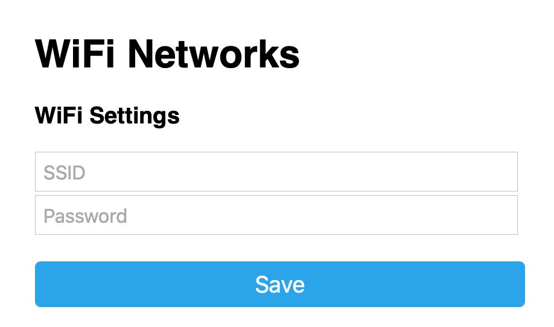

# Local control (via ESPHome)
## Components
- NodeMCU WiFi development board *1
- Servo motor (with three types of arm) *1
- Enclosure box (MDF sheet) *6
- Waving sign *1
  
---
## Hardware Setup
1. Assemble the box
> In progress
2. Plug servo to NodeMCU ( Yellow-D4, Red-3.3v, Brown-GND )

<!-- make the following images centered -->

---
## Software Setup
*Prerequisites*
- working WiFi, you know the SSID(name) & password
- computer or phone

We've already flashed the basic program, all you need to do is follow the below steps and connect it to your WiFi.

## The Overall Process
1. Connect to NodeMCU WiFi
2. Tell it your own WiFi name and password
3. Let it connect to your WiFi
4. Connect back to your own WiFi
5. Use your own WiFi to control it

### Detailed Steps
1. Plug in the micro USB cable (just for providing power, don't need to connect to a computer)
2. Use your device (PC/phone) and connect to the WiFi netowrk: "gix_iot"
3. Password: "gixmkrspc"
4. Wait for the webpage to popup, you will see this

(If the page didn't show up after you connected to the WiFi, try to go to http://192.168.4.1/)
5. An iPhone or Android device may change the WiFi network back to your home network, since the NodeMCU doesn't have an Internet connection. You may need to ensure that "Auto Join" is turned off for your other WiFi (iPhone) or forget the other network (Android); this step is only to get the NodeMCU onto your home network and then you can re-join and/or turn on "Auto Join" for your home WiFi again.
6. Enter your **own WiFi's** SSID(name) & password,
 you can use your home WiFi, phone hotspot, etc.
7. Wait a few seconds after you see the success message. Press RST button on the NodeMCU and let the NodeMCU connect to your WiFi
8. Disconnect your device from "gix_iot" and reconnect your device to your own WiFi
9. Open your browser and go to [http://servo_test.local](http://servo_test.local) you will see this page

> If you can't see this page, try refreshing the page several times in 1-2 minutes. After 1-2 minutes, if you still can't see this page. Go back to step **2.** and connect to "gix_iot" again. This time you might get a WiFi list in your popup page, connect to the WiFi you want.
10. Click Toggle, you can move the servo now 👋!
### Congratulations! 👏👏👏
Now that the WiFi connection is configured, your NodeMCU will automatically connect to your WiFi every time it boots up.

> If you want to connect to another WiFi, turn off or get away from the WiFi signal you previously connected to. Once the NodeMCU failed to connect to WiFi, it will start "ap mode" and you can reset it from step **2.**

> In the future we will have other activities involving this device! Please tinker and bring any ideas or changes up so we can bring that functionality to other cohort members!